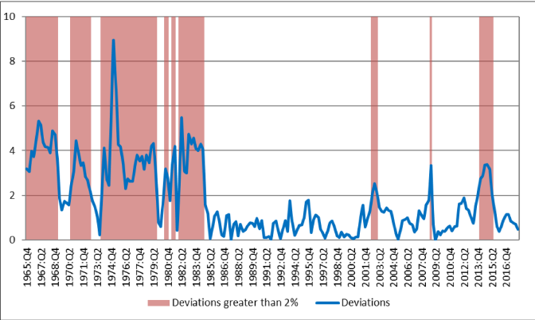
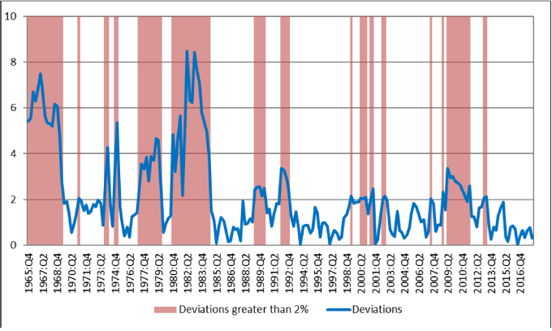
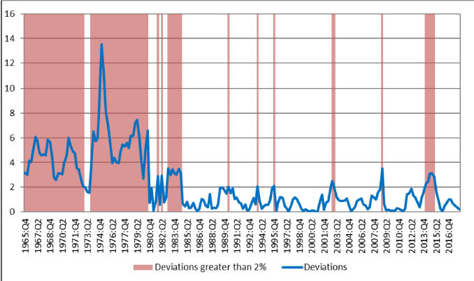
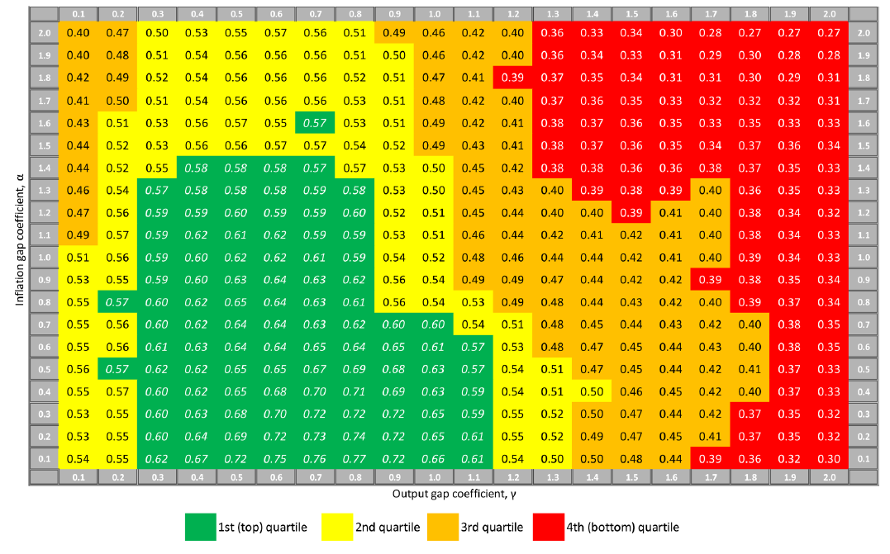

```{r setup, include=FALSE}
library(here)
knitr::opts_chunk$set(echo = FALSE)
library(captioner)
library(knitr)
figure_path<-paste0("../Figures/")
```

### Introduction

Debates about the conduct of monetary policy have evolved over time from "rules versus discretion" to "policy rules versus constrained discretion."

-   Is economic performance better under rules-based or discretionary monetary policy?

-   Friedman (1960), Kydland and Prescott (1977), Taylor (1993a) influential in the rules vs discretion debate

-   Contrained Discretion -Bernanke (2003)

    -   Dual mandate-two goals of price stability and maximum sustainable employment
    -   Any rule with positive coefficients on both gaps consistent

### Which Rule?

Given the dual mandate, which rule should **Fed** choose?

-   In the literature, Optimal policy choosen by

    -   Estimating a model
    -   simulate the model using the estimated coefficients and disturbances
    -   Minimise loss function - inflation, output gap and change of nominal interest rates
    -   Popular models- Christiano, Eichenbaum, and Evans (2005), Smets and Wouters (2007)

-   This paper

    -   Compare economic performance of the rules
    -   Calculate **Quadratic Loss Ratio**- Loss in periods of *High Deviation* divided by Loss in periods of *Low Deviation*
    -   Criterion - Loss ratio to be greater than one
    -   rules with higher loss ratios are preferred to rules with lower loss ratios

### Central Results

1.  Economic performance is better in low deviations periods than in high deviations periods for the vast majority of rules
2.  *Inflation gap* tilting rules preferred to *Output gap*

### Methodolgy

-   `r xfun::n2w(4)` benchmark rules - equal weight on *inflation* and *unemployment*

    -   Standard Taylor rule with time varying neutral interest rate
    -   Taylor rule with unemployment gap
    -   Taylor rule with 2% neutral interest rate
    -   Taylor rule with time varying

-   deviations measured as absolute deviations

-   loss calculated *`r xfun::n2w(6)`* quarters after classification

### Initial Results

-   Economic performance is better in low deviations periods than in high deviations periods
-   average loss ratio for the 100 policy rules is between 1.74 and 2.53
-   *Inflation gap* tilting rules preferred to *Output gap*
-   loss ratios are greater than one for all 80 rules with a coefficient on the inflation gap of 0.3 and above.
-   Taylor principle necessary but not sufficient condition for a policy
-   best result are for **Standard Taylor rule with time varying neutral interest rate and `r xfun::n2w(2)` percent inflation target**

### Initial Results (Contd..)

-   *Inflation gap* tilting rules preferred to *Output gap*

-   The "relative loss ratio" of the inflation gap tilting rules to the output gap tilting rules : 1.30 - 1.83

-   Results robust to

    -   higher weight on inflation loss than on unemployment loss
    -   higher weight on unemployment loss than on inflation loss
    -   high and low deviations periods defined (1.5 - 2.5 % thresholds)
    -   policy lags (4 to 8 quarters)

### Initial Assessments

-   Fed should **"constrain"** constrained direction

-   Results consistent with policy prescriptions (Woodford,2003; Orphanides and Williams, 2007; Laubach and Williams (2016))

-   Advocates addition of inflation tilting rule to the Taylor rule

### Estimation {.allowframebreaks}

#### Rule

Taylor (1993a) proposed the following monetary policy rule,
```{=tex}
\begin{equation}
i_t= \pi_t + \alpha(\pi_t - \pi_t^*) + \gamma y_t 
(\#eq:eq1)
\end{equation}
```
Combining terms, \begin{equation}
i_t= \mu + \delta \pi_t  + \gamma y_t 
(\#eq:eq2)
\end{equation} where $\delta=1+\alpha$ and $\mu=R^*-\alpha \pi^*$

-   Policy rule deviations- difference between actual fed fund rate and implied interest rate by respective rules

#### Data

-   Vintages of nominal GDP, real GDP, and GDP deflator (Source: Real-Time Data Set for Macroeconomists)
-   inflation : GDP deflator, PCE (excluding food and energy prices)
-   output gap

The paper makes use of realized values for inflation and output gap

-   Policy rate: effective average of fed funds rate,shadow federal funds rate of Wu and Xia (2016)
-   neutral real interest rate: Time varying (calculated as 10 year average of GDP growth)
-   inflation target: 2%,time varying

\framebreak

#### Constrained Discretion

in the context of \@ref(eq:eq1), constrained discretion implies

-   $\alpha >0$ so that $\delta>1$
-   $\gamma >0$

constrained discretion limits the class of Taylor rules to those where $\alpha>0$ and $\gamma >0$. \> 0.

#### Policy rule deviations

3 rules considered\
- balanced rule in Taylor (1993) : $\alpha=0.5$ and $\gamma=0.5$\
- Yellen (2012) : $\alpha=0.5$ and $\gamma=1$\
- Inflation tilting: $\alpha=1$ and $\gamma=0.5$

### 

```{r panela, echo=FALSE, fig.cap="Panel A: Balanced Taylor Rule", fig.align='center',fig.height=2,fig.width=2,out.width="100%"}

```

### 

```{r panelb, echo=FALSE, fig.cap="Panel B: Yellen Rule - $\\alpha=0.5$ and $\\gamma=1$", fig.align='center',fig.height=2,fig.width=2,out.width="100%"}

```

### 

```{r panelc, echo=FALSE, fig.cap="Panel C: Inflation tilting rule - $\\alpha=1$ and $\\gamma=0.5$", fig.align='center',fig.height=2,fig.width=2,out.width="100%"}

```

### Estimation (cont.)

#### Candidate Rules for Policy

-   All consistent rules are not optimal for fed policy\

-   Some well known estimates from the literature

    -   Taylor (1999a) : $\alpha=0.53 , \gamma=0.77$
    -   CGG (2000) :$\alpha=1.15 , \gamma=0.93$
    -   CEE (2005) : $\alpha=1.58,\gamma=0.45$
    -   Smet and Wouters (2007) :$\alpha=1.04,\gamma=0.26$

-   This paper- A different metric to evaluate the plausible policies

    -   Consider 400 rules with $\alpha$ and $\gamma$ varrying from 0.1 to 2 in increments of 0.1
    -   Calculate the **share of time**
    -   Inflation tilting rules in top quartiles ($0.1<\alpha<1$)

The average share in time for these 100 rules is 62 percent, while for the other 300 rules, it is only 44 percent.

### 

```{r share-graph, echo=FALSE, fig.cap="Share in time for 400 policy rules", fig.align='center',fig.height=2,fig.width=2,out.width="100%"}

```
### Economic Performance
Economic performance evaluated based on a quadratic loss function
\begin{equation}
Loss=\sum((\pi-\pi^*)^2+(U-U^*)^2)
(\#eq:eq3)
\end{equation}

- Quadratic loss function-equal inflation and unemployment gaps are preferred to unequal gaps  
- 
